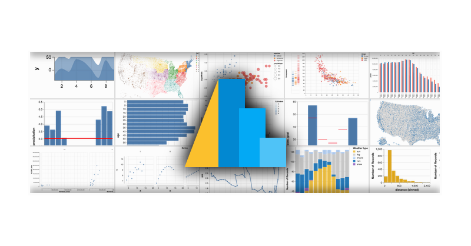

# Altair Tutorial

## Acknowledgments

Much of this tutorial comes from [Jake Vanderplas' Altair
tutorial](https://github.com/altair-viz/altair-tutorial), given at PyCon 2018. 

## Outline
- Introduction (15 min)
- Live demo (15 min)
- Chart basics (30 min)
- Binning/Aggregation (10 min)
- Experiment!!! (20 min)
- Interaction/selections (25 min)
- Closing Remarks (5 min)
